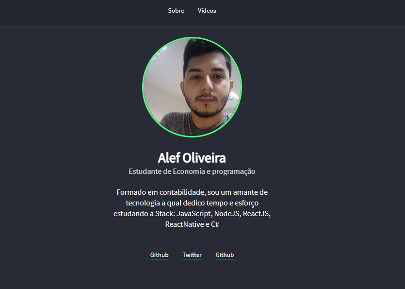
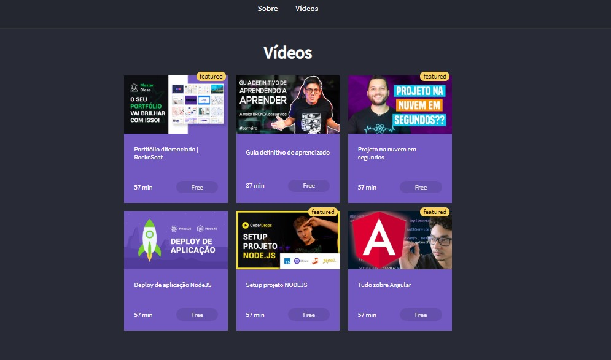

# semana 2 LouchBase Rocketseat e desafios :smile:

## Descrição do Projeto

 Projeto desenvolvido como um dos desafios para devs iniciantes na linguemgem JS da Rockeseat

- ### tecnologias
    - Html, CSS
    - Js 
        - <strong style="color:#50fa7b"> Node </strong>
        - <strong style="color:#50fa7b"> Express: </strong> Gerenciamento de rotas
        - <strong style="color:#50fa7b"> nunjunck: </strong> teamplatEngine 
        - <strong style="color:#50fa7b"> Heroku: </strong> Deploy
    <h1>Site</h1>

    ## Deploy da Aplicação com Netlify

    ## [Veja o deploy aqui](https://personportifolio-new.herokuapp.com/)

    <h3 style="text-align:center; text-decoration: none; font-weight: bold;">Página inicial</h3>

    

    <h3 style="text-align:center; text-decoration: none; font-weight: bold;">Página Vídeos</h3>

    